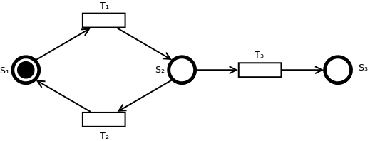
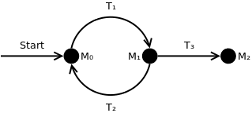

Jegliche automatische Verarbeitung von Modellen benötigt präzise Definition (des Ausführungsverhaltens). **Petrinetze** sind ein Ansatz für eine solche Modellierung.

# Syntax
Ein Petrinetz ist ein gerichteter Graph mit zwei Arten von Knoten, **Stellen** (Speichern von Informationen) und **Transitionen** (Verarbeitung von Informationen), und **Kanten**, die Stellen und Knoten alternierend mit einander verbinden.

Hier ist ein Beispielnetz:

# Ausführung
Als **Schalten** von Transitionen bezeichnet man das Übergeben einer Anzahl (es gelten Kapazitätsbeschränkungen) von **Marken** durch eine Transition von ihrer Vorgängerstelle zu ihrer Nachfolgerstelle. Eine Transition wird **aktiviert**, wenn sie die geforderte Menge an Tokens erhalten kann und die Nachfolgerstelle die Tokens aufnehmen kann. Transitionen mit 0 eingehenden Kanten generieren spontan Tokens und Transitionen mit 0 ausgehenden Kanten fressen sie auf. Zur Ausführung werden alle aktiven Transitionen eine nach der anderen (Auswahl zufällig ¯\\_(ツ)_/¯ lol) iterativ aktiviert. Eine Folge von Schaltungen ist eine **Schaltfolge**.

Die Bedeutung eines Tokens hängt von der Stelle ab, an der es plaziert ist. Der globale Zustand des Netzes, also die Position aller Tokens, ist eine **Markierung**. Eine **tote Markierung** ist der Endzustands eines Netzes, bei dem keine Schaltungen mehr stattfinden können. Eine Markierung gilt als **erreichbar**, wenn es eine Schaltfolge gibt, die das Netz in diesen Zustand überführt. Die Menge aller erreichbaren Markierungen ist die **Erreichbarkeitsmenge**.

# Erreichbarkeitstabelle
Die Erreichbarkeitstabelle funktioniert ähnlich wie bei Automaten aus der theoretischen Informatik, nur eben dass die Marken mit berücksichtigt werden müssen. Die Tabelle ist unendlich groß, falls das Netz nicht *beschränkt* ist.

Die Spalten der Tabelle sind:

* Markierungen (M0 .. Mn)

* Eine Spalte pro Stelle, in die die Marken auf der Stelle in der momentanen Markierung eingetragen werden

* Die möglichen Schaltungen aus von der momentanen Markierung aus

Die genaue Syntax ist wie immer gut inkonsistent zwischen Vorlesung und Übung, sowohl miteinander als auch mit sich selbst. Trotzdem hier eine Beispieltabelle für den Beispielgraph:

| Markierung    | S1 | S2 | S3 | Schaltungen                                                  |
| ------------- | ------------- | ------------- | ------------- | ------------------------------------------------------------ |
| M0 | 1             | 0             | 0             | T1 → M1                                |
| M1 | 0             | 1             | 0             | T2 → M0, T3 → M2 |
| M2 | 0             | 0             | 1             |                                                              |

# Erreichbarkeitsgraph
Die Erreichbarkeitstabelle in Graphform. Syntaxhinweis besteht hier ebenfalls.

# Analyse von Systemen
Simulation eines Petrinetzes:
* Kann zeigen, dass bestimmte Situationen auftreten können
* Kann *nicht* zeigen, dass bestimmte Situationen *nicht* auftreten
* Ist ein Ausschnitt aus Menge aller möglichen Verhalten

**Verifikation** ist der Beweis von Eigenschaften. **Statische Eigenschaften** betreffen die Netztopologie, **dynamische Eigenschaften** sind abhängig von der Erreichbarkeitsmenge (zB Deadlocks). Zwei wichtige Klassen von Eigenschaften sind **Sicherheit** (ein unerwünschter Zustand tritt nicht ein) und **Lebendigkeit** (ein erwünschter Zustand kann wiederholt auftreten).

## Eigenschaften von Transitionen

* **Aktivierbar**: mindestens von einer erreichbaren Markierung *aktiviert*

* **Lebendig**: aus jeder erreichbaren Markierung *aktivierbar* (nicht aktiviert!)

* **Tot**: von keiner erreichbaren Markierung aktiviert

## Eigenschaften von Markierungen

* **Erreichbar**: Markierung kann jemals vom Anfangszustand aus auftreten

    * **aus Markierung Mn**: von Mn statt Anfangszustand

* **Lebendig**: Markierung ist aus jeder erreichbaren Markierung *erreichbar*

* **Tot**: Transitionen sind in der Markierung aktivierbar (*Deadlock* im Netz)

## Eigenschaften des Netzes

* **Lebendig**: Jede *erreichbare* Markierung ist *lebendig*

* **Deadlockfrei**: Es gibt keine erreichbaren Markierungen, die tot sind

* **Tot**: Es gibt keine *aktivierbaren* Transitionen

* **Beschränkt**: Es gibt eine maximale Anzahl marken, die sich jemals im System befinden können

    * **B-sicher** (oder manchmal auch n-sicher): es können sich maximal B (oder n) Marken auf einem Knoten befinden

# Simulation

[Tapaal](http://www.tapaal.net/download/) ist ein ziemlich okayes Simulationsprogramm für Petrinetze. Es unterstützt keine Markenlimits für Knoten, funktioniert aber sonst gut.
