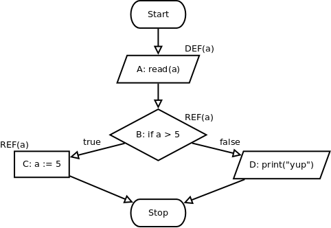

# Einführung
Dass ein Fehler auftritt muss nicht an falschen Anweisungen liegen, sondern kann auch von vorher falsch berechneten, referenzierten Werten hervorgerufen werden.

Idee: Testen der Interaktion zwischen Anweisungen, die Wert einer Variablen berechnen (definieren), und Anweisungen, die diesen Variablenwert benutzen (referenzieren).

Ein **Datenflussgraph** ist ein Kontrollflussgraph, bei dem jeder Knoten drei zusätzliche Mengen speichert:
* **DEF**: Menge der Variablen, die im Knoten definiert werden
* **UNDEF**: Menge der Variablen, die im Knoten undefiniert werden
* **REF**: Menge der Variablen, die im Knoten referenziert werden

# Alle Definitionen
Um dieses Kriterium zu erfüllen, muss jede Definition mindestens einmal referenziert werden.

# Alle DR-Interaktionen
Ein **DR-Weg** (Definition-Referenz-Weg) ist ein Weg, an dessen Anfang eine Variable definiert und an dessen Ende diese variable referenziert wird. Das Kriterium **Alle DR-Interaktionen** fordert, dass ein solcher Weg für jede Variable existiert, die definiert wird. Es fordert also in Erweiterung zu Alle Definitionen, dass die Referenz nicht nur existiert, sondern auch erreicht wird (für die Testfallmenge).

# Alle k-DR-Interaktionen
Eine normale DR-Interaktion ist eine 2-DR-Interaktion. Größere k „verfolgen” die originellen Werte durch Anweisungen hindurch.

Beispiel:

    A: read(a) | DEF(a)
    B: b = a   | REF(a)
    C: c = b   | REF(b)

Dann ist A→B→C eine 3-DR-Interaktion, weil in Knoten C `a` indirekt über `b` referenziert wird. Die 3 liegt daran, dass es 3 relevante Interaktionen (DEF(a), REF(a), REF(b)) gibt.

Größere k führen zur Verfolgung über mehr REFs hinweg. Achtung, laut Dausi ist k-DR ⊈ (k+1)-DR, die Wege müssen also um exakt k Ecken gehen.

# Alle Referenzen
Eine Erweiterung von [Alle DR-Interaktionen](#alle-dr-interaktionen). Immer wenn von einem `REF`-Knoten mehrere Kanten ausgehen, müssen diese alle mit in den Testfluss dazugenommen werden.

Beispiel:

In diesem Fall wäre das Kriterium „alle DR-Interaktionen“ mit dem Weg `(A, B, C)` abgedeckt. Für „alle Referenzen“ benötigt man allerdings *zusätzlich* noch den Weg `(A, B, D)`, da aus Knoten `B` mit `REF(a)` zwei Kanten ausgehen, die abgedeckt werden müssen.

Testdaten „alle DR-Interaktionen“: `{(6)}`

Testdaten „alle Referenzen“: `{(6), (0)}`

# Kontextüberdeckung
*pls halp*

# Alle DR-Wege
*durr*

# Alle Berechnungs-/Entscheidungs-Referenzen
Unterscheidung, ob eine Referenz in einer Berechnung oder in einer Entscheidung stattfindet.
